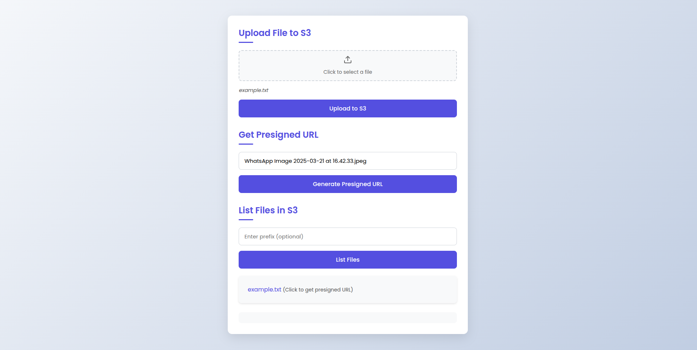

# AWS S3 and Lambda Setup Guide

This guide provides detailed steps to set up an AWS S3 bucket and a Lambda function for file upload and retrieval using presigned URLs. Follow each step carefully to ensure proper configuration.

## Prerequisites

- AWS Account
- AWS CLI configured
- Node.js installed

## Step 1: Create an S3 Bucket

1. Go to AWS Management Console.
2. Search and go to S3.
3. Click on "Create bucket".
4. Enter a bucket name.
5. Disable "Block all public access".
6. Acknowledge disabling block all public access in the yellow box.
7. Keep the rest of the settings as default.
8. Click "Create bucket".

### Bucket Policy

After the bucket is created, set the bucket policy:

1. Click on the bucket name.
2. Click on "Permissions".
3. Click on "Bucket policy" > "Edit".
4. Paste the following policy:

```json
{
    "Version": "2012-10-17",
    "Statement": [
        {
            "Effect": "Allow",
            "Principal": "*",
            "Action": "s3:ListBucket",
            "Resource": "arn:aws:s3:::secure-file-sharing-cc-project"
        },
        {
            "Sid": "AllowSpecificActions",
            "Effect": "Allow",
            "Principal": "*",
            "Action": [
                "s3:GetObject",
                "s3:PutObject"
            ],
            "Resource": "arn:aws:s3:::secure-file-sharing-cc-project/*"
        }
    ]
}
```
5. Click "Save changes".

## Step 2: Create an IAM Execution Role

1. Go to AWS Management Console.
2. Search for IAM.
3. Click on IAM.
4. Click on "Roles".
5. Click "Create role".
6. Select "AWS service" in the trusted entity type.
7. In the use case, search for Lambda.
8. Select Lambda.
9. Click "Next".
10. Add permissions:
    - Search for S3.
    - Select `AmazonS3FullAccess` (or `AmazonS3ReadOnlyAccess` if only reading files).
    - Add other permissions as needed, such as `AWSLambdaBasicExecutionRole` for logging in CloudWatch/CloudTrail.
11. Enter a role name.
12. Click "Create role".

## Step 3: Create a Lambda Function

1. Go to AWS Management Console.
2. Search for Lambda.
3. Click on Lambda.
4. Click on "Create function".
5. Select "Author from scratch".
6. Enter a function name.
7. Select runtime `Node.js 22.x`.

### Execution Role

In "Change default execution role":

- If not using other services, select "Create a new role with basic Lambda permissions".
- If using an existing role, select the role (e.g., `LambdaS3ExecutionRole`).

8. Click "Create function".

### Lambda Function Code

Paste the following code in the function code section:

```javascript
const { S3Client, PutObjectCommand, ListBucketsCommand } = require('@aws-sdk/client-s3');
const { getSignedUrl } = require('@aws-sdk/s3-request-presigner');

// Set your bucket name here or pass it as an environment variable
const BUCKET_NAME = process.env.BUCKET_NAME || 'your-bucket-name';

// Default expiration time for presigned URLs (24 hours)
const URL_EXPIRATION_SECONDS = 24 * 60 * 60;

// Initialize S3 client
const s3Client = new S3Client({ region: process.env.AWS_REGION || 'us-east-1' });

exports.handler = async (event, context) => {
  try {
    console.log('Event:', JSON.stringify(event, null, 2));
    console.log('Using bucket:', BUCKET_NAME);
    console.log('Region:', process.env.AWS_REGION || 'us-east-1');
    
    // Verify AWS credentials and S3 access
    try {
      console.log('Checking S3 connectivity...');
      const listBucketsCommand = new ListBucketsCommand({});
      const listBucketsResponse = await s3Client.send(listBucketsCommand);
      console.log('Available buckets:', listBucketsResponse.Buckets.map(b => b.Name).join(', '));
      
      if (!listBucketsResponse.Buckets.some(b => b.Name === BUCKET_NAME)) {
        console.warn(`Warning: Bucket ${BUCKET_NAME} not found in available buckets`);
      }
    } catch (connErr) {
      console.error('Error connecting to S3:', connErr);
    }
    
    let requestData;
    
    // Handle both direct Lambda invocation and API Gateway events
    if (event.body) {
      // API Gateway invocation (event.body is a string)
      requestData = JSON.parse(typeof event.body === 'string' ? event.body : '{}');
    } else {
      // Direct Lambda invocation (event itself contains the data)
      requestData = event;
    }
    
    const { action, key, contentType, base64Content } = requestData;
    console.log('Action:', action);
    console.log('Key:', key);
    
    // Proceed with the action handling
    switch (action) {
      case 'upload':
        // Validate required parameters for upload
        if (!key || !contentType || !base64Content) {
          return formatResponse(400, { 
            message: 'Missing required parameters. Please provide key, contentType, and base64Content.' 
          });
        }
        
        // Process base64 content - handle data URL format if provided
        let processedBase64 = base64Content;
        if (base64Content.startsWith('data:')) {
          processedBase64 = base64Content.split(',')[1];
        }
        
        console.log('Content Type:', contentType);
        console.log('Base64 length:', processedBase64.length);
        
        try {
          // Upload file to S3
          console.log('Attempting to upload to S3...');
          const uploadResult = await uploadToS3(key, contentType, processedBase64);
          console.log('Upload result:', JSON.stringify(uploadResult, null, 2));
          
          // Generate presigned URL for the uploaded file
          console.log('Generating presigned URL...');
          const presignedUrl = await generatePresignedUrl(key);
          console.log('Generated URL:', presignedUrl);
          
          return formatResponse(200, { 
            message: 'File uploaded successfully',
            key: key,
            presignedUrl: presignedUrl
          });
        } catch (opErr) {
          console.error('Operation error details:', JSON.stringify(opErr, null, 2));
          throw opErr; // Re-throw to be caught by the outer try/catch
        }
        
      case 'getUrl':
        // Validate required parameters for generating presigned URL
        if (!key) {
          return formatResponse(400, { 
            message: 'Missing required parameter. Please provide key.' 
          });
        }
        
        try {
          // Generate presigned URL for existing file
          console.log('Generating presigned URL for existing object...');
          const url = await generatePresignedUrl(key);
          console.log('Generated URL:', url);
          
          return formatResponse(200, { 
            key: key,
            presignedUrl: url
          });
        } catch (opErr) {
          console.error('Operation error details:', JSON.stringify(opErr, null, 2));
          throw opErr; // Re-throw to be caught by the outer try/catch
        }
        
      default:
        return formatResponse(400, { 
          message: 'Invalid action. Please specify "upload" or "getUrl".' 
        });
    }
  } catch (error) {
    console.error('Error type:', error.constructor.name);
    console.error('Error name:', error.name);
    console.error('Error message:', error.message);
    console.error('Error stack:', error.stack);
    
    return formatResponse(500, { 
      message: 'Internal server error',
      error: error.message,
      errorType: error.constructor.name,
      stack: process.env.DEBUG === 'true' ? error.stack : undefined
    });
  }
};

/**
 * Upload a file to S3
 * @param {string} key - The S3 object key
 * @param {string} contentType - The file's MIME type
 * @param {string} base64Content - Base64 encoded file content
 * @returns {Promise} - S3 upload result
 */
async function uploadToS3(key, contentType, base64Content) {
  // Convert base64 to buffer
  const buffer = Buffer.from(base64Content, 'base64');
  
  const putParams = {
    Bucket: BUCKET_NAME,
    Key: key,
    Body: buffer,
    ContentType: contentType
  };
  
  console.log('PutObject params:', JSON.stringify({
    ...putParams,
    Body: `<binary data of length ${buffer.length}>`
  }, null, 2));
  
  const command = new PutObjectCommand(putParams);
  return await s3Client.send(command);
}

/**
 * Generate a presigned URL for an S3 object
 * @param {string} key - The S3 object key
 * @returns {string} - Presigned URL
 */
async function generatePresignedUrl(key) {
  const { GetObjectCommand } = require('@aws-sdk/client-s3');
  
  const getObjectParams = {
    Bucket: BUCKET_NAME,
    Key: key
  };
  
  console.log('GetObject params:', JSON.stringify(getObjectParams, null, 2));
  
  const command = new GetObjectCommand(getObjectParams);
  return await getSignedUrl(s3Client, command, { expiresIn: URL_EXPIRATION_SECONDS });
}

/**
 * Format API Gateway response
 * @param {number} statusCode - HTTP status code
 * @param {object} body - Response body
 * @returns {object} - Formatted response
 */
function formatResponse(statusCode, body) {
  return {
    statusCode: statusCode,
    headers: {
      'Content-Type': 'application/json',
      'Access-Control-Allow-Origin': '*', // For CORS support
      'Access-Control-Allow-Credentials': true
    },
    body: JSON.stringify(body)
  };
}
```

### Environment Variables

Go to the "Configuration" tab and add the following environment variables:

```plaintext
BUCKET_NAME = your-bucket-name
```
Click "Save".

### Function URL

1. Go to the "Configuration" tab.
2. Click on "Function URL".
3. Click on "Create function URL".
4. Select auth type as "None".
5. Click on "Additional settings".
6. Select "Configure cross-origin resource sharing (CORS)".
7. In "Allow Origin" type `*`.
8. In "Allow Headers" type `content-type`.
9. Click "Add new value" in "Allow Headers" and enter `authorization`.
10. In "Allow Methods" select `*` or the methods you want to allow.
11. In "Max age" enter `120`.
12. Click "Save".

Copy the function URL. This is the URL you will use to upload files, get presigned URLs, and get the file.

## Step 4: Update Frontend

Update the Lambda function URL in the frontend.

### index.html

Change the following line in `index.html`:
for example:

```javascript
- const API_URL = "https://your-lambda-url.amazonaws.com/Prod/";
+ const API_URL = "https://qag7xtwnkckns6hkh7uwuer2cy0hgrro.lambda-url.us-east-1.on.aws/";
```

> Note: It might not work on browsers from localhost. You might need to host the frontend on a server to get an HTTPS URL for it and then use it. For example, you may deploy it on Vercel, Netlify, GitHub Pages, etc.

> If you want to use the frontend from localhost, you can use a tool like ngrok to create a secure tunnel to your localhost server.

Otherwise, you may use curl requests to test the Lambda function URL.



### Example cURL Commands

#### 1. Upload a File

Assuming your file content is base64 encoded (for example purposes, `"SGVsbG8sIFdvcmxkIQ=="` is `"Hello, World!"`):

```bash
curl -X POST https://your-api-endpoint \
  -H "Content-Type: application/json" \
  -d '{
    "action": "upload",
    "fileName": "sample.txt",
    "fileContent": "SGVsbG8sIFdvcmxkIQ=="
  }'
```

You may do something like this to get the base64 encoded content of a file:

```bash
curl -X POST https://your-api-endpoint \
  -H "Content-Type: application/json" \
  -d '{
    "action": "upload",
    "fileName": "sample.txt",
    "fileContent": "$(base64 -w 0 sample.txt)"
  }'
```

> Note: The `-w 0` option is used to prevent line wrapping in the base64 output. Adjust this based on your shell and requirements.

> Note: Ensure that the file name and content are correctly specified. The file content should be base64 encoded.

#### 2. Get a Presigned URL

This command retrieves a presigned URL for an existing file (`sample.txt`):

```bash
curl -X POST https://your-api-endpoint \
  -H "Content-Type: application/json" \
  -d '{
    "action": "get_presigned_url",
    "fileName": "sample.txt"
  }'
```

#### 3. List Files Recursively

This command lists all files in the bucket. You can optionally include a `prefix` to filter the results:

```bash
curl -X POST https://your-api-endpoint \
  -H "Content-Type: application/json" \
  -d '{
    "action": "list_files",
    "prefix": ""
  }'
```

If you want to filter by a specific folder (for example, files under `"folder1/"`), update the `prefix` accordingly:

```bash
curl -X POST https://your-api-endpoint \
  -H "Content-Type: application/json" \
  -d '{
    "action": "list_files",
    "prefix": "folder1/"
  }'
```

These examples should help you test all three actions with your Lambda function.

## Usage Guide for the Frontend Interface

The frontend interface provides a user-friendly way to interact with an AWS Lambda function to perform three main actions: uploading files to S3, generating presigned URLs, and listing files in an S3 bucket. Here’s how to use each section:

### 1. Upload File to S3

**Steps**:
1. **Select a File**: Click on the area labeled "Click to select a file" to open a file picker dialog.
2. **Choose a File**: Select the file you want to upload from your local machine. The selected file's name will appear below the file picker.
3. **Upload**: Click the "Upload to S3" button to upload the file to the S3 bucket. A message will confirm the successful upload.

### 2. Get Presigned URL

**Steps**:
1. **Enter File Name**: In the input field under "Get Presigned URL", enter the name of the file for which you want to generate a presigned URL.
2. **Generate URL**: Click the "Generate Presigned URL" button. The presigned URL will be displayed below the button, allowing temporary access to the file.

### 3. List Files in S3

**Steps**:
1. **Enter Prefix (Optional)**: In the input field under "List Files in S3", you can enter a prefix to filter the files (optional).
2. **List Files**: Click the "List Files" button. The list of files will be displayed below the button. Each file name is a clickable link that generates a presigned URL for that file.

### Notes

- Ensure the Lambda function URL is correctly set in the frontend code.
- The frontend might not work on browsers from localhost due to CORS issues. Consider hosting the frontend on a server with an HTTPS URL.
- Tools like ngrok can be used to create a secure tunnel to your localhost server for testing purposes.

This guide should help you effectively use the frontend to interact with your Lambda function.


## **FAQs**

### **What is a presigned URL, and why is it used?**

A presigned URL is a temporary, secure link that allows users to upload or download files from an S3 bucket without needing direct AWS credentials. It helps ensure secure file sharing while restricting unauthorized access.

### **How long is the presigned URL valid?**

By default, the presigned URLs in this setup are valid for 24 hours (86,400 seconds). You can modify this duration in the `URL_EXPIRATION_SECONDS` variable inside the Lambda function.

### **Can I restrict access to certain users or roles?**

Yes, you can modify the S3 bucket policy and IAM roles to allow only specific AWS users or services to generate and use presigned URLs. You may also implement authentication in the API Gateway.

### **Can I allow only specific file types for upload?**

Yes, you can validate the `contentType` in the Lambda function before generating a presigned URL or uploading a file to S3.

### **How do I debug errors related to S3 access?**

Check the CloudWatch logs for your Lambda function to view detailed error messages. Ensure that your IAM role has the correct permissions, and verify the S3 bucket name and region.

### **Is it possible to set an expiration time for uploaded files?**

Yes, you can configure an S3 lifecycle rule to automatically delete or archive files after a specified duration.

### **How do I test the Lambda function locally?**

You can use the AWS SAM CLI or invoke the function using AWS CLI with a test payload. Alternatively, you can use a tool like Postman to send API Gateway requests.

### **How do I enable CORS for my API Gateway?**

In API Gateway settings, enable CORS by allowing `*` as the origin or specifying allowed domains. You can also configure the headers in the Lambda function response.

### **Can I use a different runtime instead of Node.js?**

Yes, AWS Lambda supports Python, Go, Java, and other runtimes. You would need to rewrite the Lambda function accordingly.

### **How can I improve the security of this setup?**

- Restrict IAM permissions to only necessary actions.
- Use AWS WAF to protect API Gateway.
- Enable logging and monitoring via CloudWatch.
- Implement authentication for API requests.